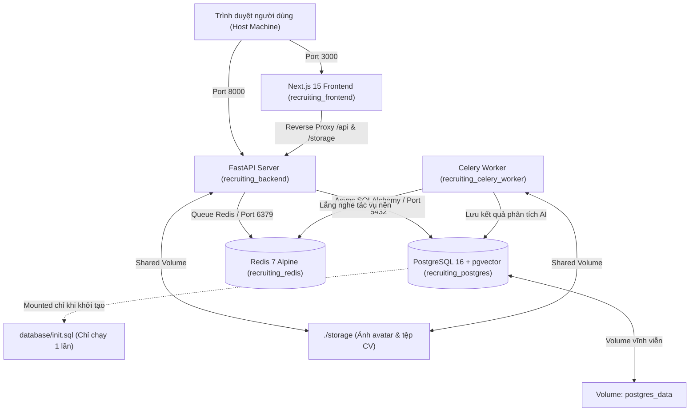

# HƯỚNG DẪN VẬN HÀNH HỆ THỐNG BẰNG DOCKER & QUẢN LÝ CƠ SỞ DỮ LIỆU
## NỀN TẢNG TUYỂN DỤNG NHÂN SỰ AI RECRUITING PLATFORM

> **Dành cho:** Nhà phát triển & Quản trị hệ thống trên môi trường Windows / Linux / macOS.  
> **Nguyên tắc cốt lõi:**
> 1. Dữ liệu được bảo toàn vĩnh viễn qua Docker Volume (`postgres_data`), **KHÔNG tạo lại DB** nếu đã có dữ liệu.
> 2. Toàn bộ cấu trúc bảng và dữ liệu mẫu sống đã được trích xuất thành file SQL riêng độc lập tại `database/init.sql`.
> 3. Cơ chế `IF NOT EXISTS` và `ON CONFLICT DO NOTHING` đảm bảo an toàn 100% không bao giờ gây lỗi xung đột khóa chính.

---

## 1. TỔNG QUAN KIẾN TRÚC DOCKER COMPOSE

Hệ thống được đóng gói thành **5 Container độc lập** kết nối qua mạng nội bộ:


---

## 2. CƠ CHẾ BẢO VỆ DỮ LIỆU ("KHÔNG TẠO LẠI DB NẾU ĐÃ CÓ")

Hệ thống thiết lập cơ chế **phòng vệ 2 lớp** để đảm bảo dữ liệu không bao giờ bị xóa hoặc tạo lại ngoài ý muốn:

### Lớp 1: Cơ chế Docker Volume Persistence
Trong file `docker-compose.yml`:
```yaml
services:
  postgres:
    image: pgvector/pgvector:pg16
    volumes:
      - postgres_data:/var/lib/postgresql/data
      - ./database/init.sql:/docker-entrypoint-initdb.d/init.sql:ro
```
- **Khi khởi động lần đầu tiên (Volume trống):** PostgreSQL thấy thư mục `/var/lib/postgresql/data` chưa có gì, nó sẽ tự động chạy file `database/init.sql` để tạo toàn bộ bảng và nạp sẵn dữ liệu sống.
- **Khi khởi động từ lần thứ 2 trở đi (Đã có DB):** PostgreSQL phát hiện dữ liệu đã tồn tại trong `postgres_data`, nó sẽ **bỏ qua hoàn toàn** thư mục `/docker-entrypoint-initdb.d/`. **Không tạo lại DB, không chạy lại init.sql, dữ liệu được giữ nguyên vẹn 100%.**

### Lớp 2: Câu lệnh SQL Idempotent (Chống xung đột)
Trong file `database/init.sql`:
- Mọi bảng: `CREATE TABLE IF NOT EXISTS public.<table> (...)`
- Mọi chỉ mục: `CREATE INDEX IF NOT EXISTS <index_name> ON ...`
- Mọi bản ghi: `INSERT INTO public.<table> VALUES (...) ON CONFLICT DO NOTHING;`
-> Dù bạn có vô tình thực thi thủ công file này nhiều lần, hệ thống vẫn không bị lỗi xung đột hoặc ghi đè dữ liệu cũ.

---

## 3. CÁCH TÁCH & XUẤT DỮ LIỆU SQL RA FILE RIÊNG BẤT KỲ LÚC NÀO

Khi bạn đã nộp thêm CV, tạo thêm tin tuyển dụng hoặc có dữ liệu mới trên máy và muốn cập nhật lại file SQL:

Chạy script tự động đã được lập trình sẵn:
```powershell
cd backend
python export_db_to_sql.py
```
**Kết quả:** Script tự động kết nối PostgreSQL, trích xuất dữ liệu, định dạng cú pháp an toàn và xuất thẳng ra file độc lập:
`database/init.sql` (Dung lượng ~1 MB, đầy đủ 8 bảng ORM, dữ liệu ứng viên, phỏng vấn, điểm số AI và ảnh avatar).

---

## 4. HƯỚNG DẪN CÁC BƯỚC CHẠY DOCKER TRÊN WINDOWS

### Bước 1: Kiểm tra Docker Desktop
Đảm bảo phần mềm **Docker Desktop** đã được mở và đang chạy trên Windows.  
Kiểm tra tại PowerShell:
```powershell
docker --version
docker compose version
```

### Bước 2: Kiểm tra xung đột cổng (Port Conflict Check)
Docker Compose sử dụng các cổng: `5432` (DB), `6379` (Redis), `8000` (Backend), `3000` (Frontend).  
Nếu trước đó bạn đang chạy PostgreSQL hoặc tiến trình Python cục bộ trên máy, hãy dừng chúng hoặc kiểm tra:
```powershell
netstat -ano | findstr :8000
netstat -ano | findstr :3000
```

### Bước 3: Chuẩn bị file môi trường `.env`
Đảm bảo file `.env` tại thư mục gốc dự án có cấu hình AI Gemini:
```env
LLM_PROVIDER=gemini
GEMINI_API_KEY=AQ.Ab8RN6JOeLRRQ2mKa3GiIMIUn_6Ggq_TYfqdzVw1KjPeZAbvkw
GEMINI_MODEL=gemini-3.1-flash-lite
GEMINI_BASE_URL=https://generativelanguage.googleapis.com/v1beta/openai/
SECRET_KEY=secret-key-ai-recruiting-2026
```

### Bước 4: Khởi chạy toàn bộ hệ thống bằng 1 lệnh duy nhất
Tại thư mục gốc dự án:
```powershell
docker compose up -d --build
```
> **Giải thích tham số:**
> - `-d`: Chạy ngầm dưới nền (Detached mode).
> - `--build`: Tự động biên dịch lại mã nguồn mới nhất cho Backend và Frontend.

### Bước 5: Kiểm tra trạng thái các Container
```powershell
docker compose ps
```
Cả 5 container sẽ hiển thị trạng thái `Up` (hoặc `healthy`):
- `recruiting_postgres` (Port 5432)
- `recruiting_redis` (Port 6379)
- `recruiting_backend` (Port 8000)
- `recruiting_celery_worker`
- `recruiting_frontend` (Port 3000)

### Bước 6: Xem Logs trực tiếp (Nếu cần giám sát)
```powershell
# Xem log toàn bộ hệ thống:
docker compose logs -f

# Hoặc xem log riêng của Backend:
docker compose logs -f backend

# Xem log Celery Worker xử lý nền AI:
docker compose logs -f celery-worker
```

---

## 5. ĐỊA CHỈ TRUY CẬP CÁC PHÂN HỆ

| Phân Hệ | Đường Dẫn URL | Mô Tả |
| :--- | :--- | :--- |
| **Giao diện Người dùng (Frontend)** | [http://localhost:3000](http://localhost:3000) | Dashboard, Pipeline Kanban, Xem CV, Avatar & Đánh giá |
| **Cổng Ứng viên Nộp hồ sơ** | [http://localhost:3000/jobs/public](http://localhost:3000/jobs/public) | Nộp CV đính kèm (hỗ trợ bóc tách Avatar tự động) |
| **Tài liệu API Backend (Swagger)** | [http://localhost:8000/docs](http://localhost:8000/docs) | 16 REST APIs tương tác trực tiếp |
| **Kiểm tra Sức khỏe Hệ thống** | [http://localhost:8000/health](http://localhost:8000/health) | Trạng thái API Server & Dịch vụ AI Gemini |

---

## 6. QUẢN LÝ VÀ DỪNG HỆ THỐNG AN TOÀN

### Dừng hệ thống (BẢO TOÀN DỮ LIỆU 100%):
```powershell
docker compose down
```
*(Lệnh này chỉ gỡ bỏ container và giải phóng RAM/CPU. Dữ liệu trong volume `postgres_data` và thư mục `./storage` được giữ nguyên).*

### Khởi động lại ở lần tiếp theo:
```powershell
docker compose up -d
```
*(Hệ thống bật lại chỉ sau 3 giây với đầy đủ dữ liệu cũ, không tạo lại database).*

### Trường hợp muốn XÓA SẠCH làm lại từ đầu (Chỉ khi cần thiết):
```powershell
docker compose down -v
```
*(Tham số `-v` sẽ xóa volume `postgres_data`. Khi chạy lại `docker compose up -d`, hệ thống sẽ tự động lấy lại dữ liệu chuẩn từ file `database/init.sql`).*

---

## 7. XỬ LÝ SỰ CỐ THƯỜNG GẶP (TROUBLESHOOTING)

### Sự cố 1: Lỗi `500 (Internal Server Error)` khi Frontend gọi `/api/v1/...`
- **Hiện tượng:** Trình duyệt báo `GET /api/v1/candidates 500` hoặc `/api/v1/jobs/public 500`.
- **Nguyên nhân:** Next.js chạy chế độ standalone biên dịch cứng địa chỉ proxy tại thời điểm build. Nếu không truyền `BACKEND_INTERNAL_URL=http://backend:8000`, Next.js sẽ chuyển tiếp nhầm về `http://localhost:8000` bên trong container.
- **Cách khắc phục:** 
  1. `Dockerfile` và `docker-compose.yml` đã được cấu hình sẵn `args: BACKEND_INTERNAL_URL=http://backend:8000`.
  2. File `next.config.mjs` đã có fallback tự động trỏ sang `http://backend:8000` khi ở môi trường production.

### Sự cố 2: Lỗi PostgreSQL `unrecognized configuration parameter "transaction_timeout"`
- **Hiện tượng:** Khởi động database báo lỗi với tham số `transaction_timeout`.
- **Nguyên nhân:** File SQL dump từ máy chủ PostgreSQL 17+ có chứa thiết lập `SET transaction_timeout = 0;` vốn không được hỗ trợ trên PostgreSQL 16.
- **Cách khắc phục:** Script `backend/export_db_to_sql.py` và `database/init.sql` đã tự động loại bỏ câu lệnh này để tương thích hoàn toàn với mọi phiên bản PostgreSQL.

---
*Tài liệu được thiết lập bởi Trợ lý Lập trình Antigravity - Hệ thống Tuyển dụng AI.*
