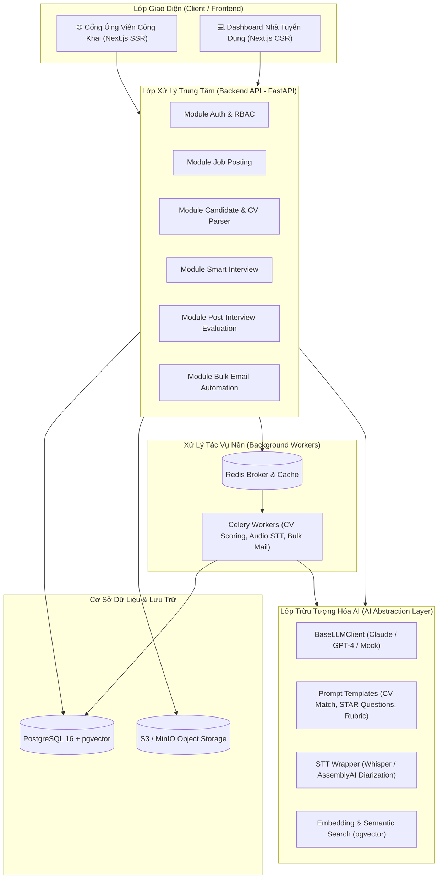

# 🤖 Nền Tảng Website Tuyển Dụng Ứng Dụng AI
### *AI-Powered Enterprise Recruitment Platform*

[](https://fastapi.tiangolo.com/)
[](https://nextjs.org/)
[](https://www.typescriptlang.org/)
[](https://www.postgresql.org/)
[](https://docs.celeryq.dev/)
[](https://www.docker.com/)

---

## 📖 1. Giới Thiệu Tổng Quan

**AI Recruiting Platform** là giải pháp phần mềm tuyển dụng toàn diện dành cho doanh nghiệp, số hóa toàn bộ vòng đời tuyển dụng từ khâu đăng tin (JD), tiếp nhận & sàng lọc hồ sơ ứng viên (CV), đặt lịch phỏng vấn thông minh, phân tích băng ghi âm buổi phỏng vấn đến phát hành thư mời nhận việc hoặc thông báo kết quả qua email hàng loạt.

Điểm khác biệt cốt lõi của nền tảng là **tích hợp trí tuệ nhân tạo (AI/LLM) làm trợ lý hỗ trợ con người**, tăng tốc độ xử lý và chuẩn hóa chất lượng tuyển dụng theo nguyên tắc:
> ⚖️ **Nguyên tắc "Human-in-the-loop":** Mọi kết quả chấm điểm CV, đề xuất câu hỏi hay phân tích buổi phỏng vấn từ AI đều chỉ mang tính chất tham khảo. Quyết định tuyển dụng cuối cùng luôn thuộc về con người (HR / Ban Quản lý).

---

## 🏛️ 2. Kiến Trúc Hệ Thống (Architecture)

Hệ thống được thiết kế theo mô hình phân lớp hiện đại: **Backend Modular DDD-lite** kết hợp **Frontend Next.js App Router (SSR & CSR)** và **Lớp AI/LLM hoàn toàn độc lập**.



### Điểm mấu chốt trong thiết kế:
1. **Lớp AI tách biệt (`backend/app/ai/`):** Các module nghiệp vụ (`candidate`, `interview`, `evaluation`) chỉ gọi thông qua giao diện thống nhất `llm_client.py`. Việc đổi nhà cung cấp mô hình (Anthropic Claude ⇄ OpenAI GPT ⇄ Local LLM) chỉ cần cấu hình lại một nơi duy nhất mà không ảnh hưởng đến logic nghiệp vụ.
2. **Xử lý nền không chặn (Non-blocking):** Các tác vụ AI nặng (chấm điểm hàng trăm CV, bóc băng ghi âm 45-60 phút) được đẩy vào hàng đợi Redis và thực thi bất đồng bộ qua Celery Worker.
3. **Lưu vết và giải trình (Auditability & Explainability):** Kết quả chấm điểm luôn đi kèm giải thích nguyên nhân theo từng tiêu chí (kỹ năng, kinh nghiệm, học vấn) và ghi chú thời điểm (timestamp) trên băng ghi âm.

---

## 📂 3. Cấu Trúc Thư Mục Dự Án

```
AI_recruiting staff/
├── docker-compose.yml                      # Điều phối cụm dịch vụ Docker (Postgres, Redis, App, Worker)
├── .env.example                            # Biến môi trường mẫu
├── README.md                               # Hướng dẫn chi tiết hệ thống (tài liệu này)
├── emploment_status.md                     # Báo cáo chi tiết quá trình thiết lập và triển khai
│
├── backend/                                # HỆ THỐNG BACKEND (Python FastAPI)
│   ├── Dockerfile
│   ├── requirements.txt
│   ├── alembic.ini                         # Cấu hình migrations
│   ├── alembic/
│   │   ├── env.py
│   │   └── script.py.mako
│   ├── app/
│   │   ├── main.py                         # FastAPI App & Router Registry
│   │   ├── core/
│   │   │   ├── config.py                   # Cấu hình Pydantic Settings
│   │   │   ├── security.py                 # Bcrypt hashing & JWT token
│   │   │   └── database.py                 # SQLAlchemy Engine & Session
│   │   ├── modules/                        # Domain Modules (Modular DDD-lite)
│   │   │   ├── auth/                       # Phân quyền, multi-tenant & người dùng
│   │   │   ├── job_posting/                # Quản lý tin JD & trọng số tiêu chí AI
│   │   │   ├── candidate/                  # Tiếp nhận hồ sơ, parse CV & AI match
│   │   │   ├── interview/                  # Lịch phỏng vấn thông minh & chống trùng lịch
│   │   │   ├── evaluation/                 # Đánh giá sau phỏng vấn & bóc băng ghi âm
│   │   │   └── email/                      # Email hàng loạt & templates HTML
│   │   ├── ai/                             # LỚP AI ĐỘC LẬP
│   │   │   ├── llm_client.py               # Lớp trừu tượng Claude/OpenAI/Mock
│   │   │   ├── prompts/                    # Quản lý Prompt tập trung
│   │   │   ├── embeddings.py               # Vector embeddings & Semantic search
│   │   │   ├── stt.py                      # Speech-to-Text & Diarization
│   │   │   └── schemas.py                  # Pydantic structured output cho LLM
│   │   ├── workers/                        # Celery Tasks xử lý nền
│   │   │   ├── celery_app.py
│   │   │   ├── tasks_cv_scoring.py
│   │   │   ├── tasks_interview_analysis.py
│   │   │   └── tasks_bulk_email.py
│   │   └── shared/                         # Exception, RBAC Permissions, Utils
│   └── tests/                              # Bộ kiểm thử tự động Pytest
│       ├── conftest.py
│       ├── ai/test_llm_client.py
│       └── modules/
│           ├── test_auth.py
│           ├── test_job_posting.py
│           └── test_candidate.py
│
└── frontend/                               # HỆ THỐNG FRONTEND (Next.js 15 + TypeScript)
    ├── Dockerfile
    ├── package.json
    ├── tsconfig.json
    ├── tailwind.config.ts
    ├── next.config.mjs
    ├── app/                                # Next.js App Router
    │   ├── layout.tsx
    │   ├── page.tsx                        # Dashboard chính
    │   ├── (public)/                       # Cổng ứng viên công khai
    │   │   ├── jobs/public/page.tsx        # Bảng tin việc làm
    │   │   ├── jobs/[slug]/page.tsx        # Chi tiết JD theo SEO slug
    │   │   └── apply/[jobId]/page.tsx      # Form nộp CV & upload file
    │   └── (dashboard)/                    # HR Management Dashboard
    │       ├── jobs/page.tsx               # Quản lý JD & trọng số AI
    │       ├── candidates/page.tsx         # Pipeline Kanban ứng viên
    │       ├── candidates/[id]/page.tsx    # Hồ sơ chi tiết & MatchScoreCard
    │       ├── interviews/page.tsx         # Quản lý phỏng vấn & gợi ý câu hỏi
    │       ├── evaluations/page.tsx        # Đánh giá sau PV & transcript audio
    │       └── reports/page.tsx            # Báo cáo Funnel & Time-to-Hire
    ├── components/
    │   ├── ui/                             # Button, Card, Badge, Modal, Table
    │   ├── candidate/                      # MatchScoreCard, CandidatePipeline
    │   ├── interview/                      # SchedulePicker, AIQuestionSuggestions
    │   └── evaluation/                     # TranscriptViewer (Diarization & Timestamps)
    ├── lib/
    │   ├── api/                            # Client gọi API FastAPI theo module
    │   └── utils/                          # Hàm định dạng, helpers
    └── types/                              # TypeScript interfaces đồng bộ với Backend
```

---

## 🚀 4. Hướng Dẫn Cài Đặt & Khởi Chạy

### Yêu cầu tiên quyết:
- [Docker](https://docs.docker.com/get-docker/) và Docker Compose (Khuyến nghị).
- Hoặc chạy local: **Python 3.11+**, **Node.js 20+**, **PostgreSQL 16**, **Redis 7**.

---

### Cách 1: Khởi chạy bằng Docker Compose (Khuyên dùng - 1 lệnh duy nhất)

```bash
# 1. Clone repository (nếu chưa clone)
git clone https://github.com/NTDat-16/AI_recruiting-staff.git
cd AI_recruiting-staff

# 2. Khởi tạo file biến môi trường từ mẫu
cp .env.example .env

# 3. Khởi động toàn bộ hệ thống
docker-compose up --build
```

Sau khi khởi động thành công:
| Dịch vụ | Địa chỉ truy cập | Ghi chú |
| :--- | :--- | :--- |
| **Frontend Web App** | `http://localhost:3000` | Giao diện HR Dashboard & Quản lý |
| **Cổng Ứng Viên Công Khai** | `http://localhost:3000/jobs/public` | Trang tìm việc & nộp hồ sơ |
| **Backend API Docs (Swagger)** | `http://localhost:8000/docs` | Tài liệu API tương tác trực tiếp |
| **Backend API Healthcheck** | `http://localhost:8000/health` | Kiểm tra tình trạng kết nối |

---

### Cách 2: Khởi chạy thủ công cho Môi Trường Phát Triển (Local Development)

#### 1. Khởi động Cơ sở dữ liệu & Message Broker
Khởi chạy PostgreSQL và Redis (có thể dùng docker):
```bash
docker run -d --name local-postgres -p 5432:5432 -e POSTGRES_PASSWORD=postgres -e POSTGRES_DB=recruiting_db pgvector/pgvector:pg16
docker run -d --name local-redis -p 6379:6379 redis:7-alpine
```

#### 2. Cài đặt và chạy Backend (FastAPI)
```bash
cd backend

# Tạo và kích hoạt môi trường ảo Python
python -m venv venv
# Trên Windows PowerShell:
.\venv\Scripts\Activate.ps1
# Trên macOS / Linux:
# source venv/bin/activate

# Cài đặt thư viện phụ thuộc
pip install -r requirements.txt

# Chạy máy chủ API
uvicorn app.main:app --reload --port 8000
```

#### 3. Chạy Celery Background Worker
Mở một terminal mới:
```bash
cd backend
# Trên Windows:
.\venv\Scripts\Activate.ps1
celery -A app.workers.celery_app worker --loglevel=info -P solo
# Trên macOS / Linux:
# celery -A app.workers.celery_app worker --loglevel=info
```

#### 4. Cài đặt và chạy Frontend (Next.js)
Mở một terminal khác:
```bash
cd frontend

# Cài đặt dependencies
npm install

# Khởi chạy máy chủ phát triển
npm run dev
```
Truy cập `http://localhost:3000`.

---

## ⚙️ 5. Cấu Hình Biến Môi Trường (.env)

Các biến môi trường chính được định nghĩa trong `.env.example`:

| Tên biến | Giá trị mặc định | Mô tả |
| :--- | :--- | :--- |
| `DATABASE_URL` | `postgresql+asyncpg://...` | Chuỗi kết nối PostgreSQL async (AsyncPG) |
| `SYNC_DATABASE_URL`| `postgresql://...` | Chuỗi kết nối PostgreSQL đồng bộ cho Alembic |
| `REDIS_URL` | `redis://localhost:6379/0` | URL kết nối Redis Cache |
| `CELERY_BROKER_URL`| `redis://localhost:6379/1` | Message Broker cho tác vụ Celery |
| `SECRET_KEY` | `your-secret-key` | Khóa bí mật ký mã hóa JWT Token |
| `LLM_PROVIDER` | `mock` | Nhà cung cấp AI: `anthropic`, `openai`, hoặc `mock` (không cần API key) |
| `ANTHROPIC_API_KEY`| `""` | Khóa API Anthropic Claude (khi dùng `LLM_PROVIDER=anthropic`) |
| `OPENAI_API_KEY` | `""` | Khóa API OpenAI (khi dùng `LLM_PROVIDER=openai`) |
| `STT_PROVIDER` | `mock` | Nhà cung cấp Speech-to-Text: `whisper`, `assemblyai`, hoặc `mock` |
| `WHISPER_API_KEY` | `""` | Khóa API Whisper bóc băng âm thanh |
| `EMAIL_PROVIDER` | `mock` | Nhà cung cấp dịch vụ gửi email: `sendgrid`, `ses`, hoặc `mock` |

---

## 💡 6. Các Phân Hệ Chức Năng Chính

### 1. Phân quyền người dùng & Đa doanh nghiệp (Multi-tenant)
- Hỗ trợ nhiều công ty độc lập (`Company`) trên cùng hệ thống.
- 5 nhóm quyền hạn: `Super Admin`, `Company Admin`, `HR`, `Interviewer`, `Candidate`.
- Xác thực chuẩn JWT Bearer qua giao thức OAuth2.

### 2. Quản lý Tin Tuyển Dụng & Trọng Số Chấm Điểm AI
- Vòng đời tin đăng: `Nháp` → `Chờ duyệt` → `Đang tuyển` → `Tạm dừng` → `Đóng`.
- Tự động đóng tin khi quá hạn nộp hồ sơ.
- Cho phép HR cấu hình tỷ trọng điểm số theo từng vị trí (ví dụ: Kỹ năng 40%, Kinh nghiệm 30%, Học vấn 15%, Kỹ năng phụ 15%).

### 3. Tiếp Nhận Hồ Sơ & Chấm Điểm AI (CV Matching)
- Tiếp nhận file PDF, DOCX từ ứng viên hoặc HR upload.
- Tự động gộp hồ sơ nếu ứng viên trùng email, giữ nguyên lịch sử ứng tuyển.
- AI tính điểm phù hợp từ 0 đến 100%, xuất bảng phân tích chi tiết tiêu chí, điểm mạnh (strengths), điểm còn thiếu (gaps) và khuyến nghị cho HR.
- **Human-in-the-loop:** HR đánh giá lại độ chính xác chấm điểm của AI (1-5 sao) để tinh chỉnh mô hình.
- Quản lý quy trình tuyển dụng trực quan qua **Kanban Pipeline**.

### 4. Đặt Lịch Phỏng Vấn Thông Minh (Smart Interview)
- Kiểm tra xung đột lịch và ngăn chặn trùng giờ của người phỏng vấn.
- Tự động sinh link Google Meet nếu phỏng vấn Online, chỉ định phòng họp nếu Offline.
- Tự động gọi AI phân tích JD và CV để đề xuất danh sách câu hỏi phỏng vấn tình huống (STAR Method) phân loại theo độ khó (Dễ / Trung bình / Khó).
- Ứng viên có thể Xác nhận, Yêu cầu dời lịch hoặc Từ chối qua cổng thông tin.

### 5. Đánh Giá Sau Phỏng Vấn & Phân Tích Ghi Âm (Audio STT)
- Người phỏng vấn nhập đánh giá thủ công theo khung Rubric chuẩn hóa.
- Cho phép tải file ghi âm buổi phỏng vấn (bắt buộc có xác nhận đồng ý của ứng viên).
- AI bóc băng văn bản (**Speech-to-Text**), phân tách rõ ràng người nói (**Speaker Diarization**) và gán mốc thời gian (**Timestamps**).
- Tự động tổng hợp báo cáo hợp nhất (**Consolidated Report**) giữa đánh giá của con người và phân tích AI.

### 6. Email Hàng Loạt Tự Động Hóa (Bulk Email Automation)
- Thư viện mẫu HTML chuyên nghiệp: Thư mời phỏng vấn, Thông báo trúng tuyển/Offer, Thư cảm ơn & Talent Pool.
- Tính năng xem trước (**Preview**) email đã cá nhân hóa tên ứng viên, vị trí, giờ họp trước khi phát hành.
- **Cơ chế chống gửi trùng:** Ngăn chặn tuyệt đối việc gửi 2 email cùng loại cho cùng một ứng viên trong cùng chu kỳ.

---

## 🧪 7. Chạy Bộ Kiểm Thử Tự Động (Testing)

Hệ thống đi kèm bộ kiểm thử tự động sử dụng **Pytest** và cơ sở dữ liệu in-memory SQLite (không cần cài đặt PostgreSQL trước vẫn kiểm thử được toàn bộ API):

```bash
cd backend

# Chạy toàn bộ test suites
pytest -v

# Xem báo cáo độ bao phủ mã (Coverage)
pytest --cov=app tests/
```

Danh mục các bài kiểm thử:
- `tests/ai/test_llm_client.py`: Kiểm thử lớp trừu tượng AI (CV matching, question generation, embeddings, STT).
- `tests/modules/test_auth.py`: Kiểm thử luồng đăng ký, đăng nhập và lấy thông tin người dùng.
- `tests/modules/test_job_posting.py`: Kiểm thử vòng đời JD, xuất bản và xem public slug.
- `tests/modules/test_candidate.py`: Kiểm thử nộp hồ sơ, AI matching, cập nhật pipeline và phản hồi Human-in-the-loop.

---

## 🗺️ 8. Lộ Trình Triển Khai (Development Roadmap)

- [x] **Giai đoạn 1 — Nền tảng cốt lõi (MVP):** Hoàn thành khung Auth RBAC, Quản lý JD, Cổng nộp CV công khai, Pipeline Kanban, Lịch phỏng vấn cơ bản, Mẫu email và Dashboard thống kê.
- [x] **Giai đoạn 2 — Tích hợp AI cơ bản:** Hoàn thành module parse CV, lớp trừu tượng AI chấm điểm % phù hợp CV-JD kèm explainability, gợi ý câu hỏi phỏng vấn ngữ cảnh hóa và cơ chế thu thập phản hồi HR.
- [x] **Giai đoạn 3 — AI nâng cao:** Khung xử lý âm thanh ghi âm (STT + Diarization + Timestamps), rubric evaluation, báo cáo hợp nhất, chống trùng email.
- [ ] **Giai đoạn 4 — Tối ưu & Mở rộng:** Kích hoạt tính năng tìm kiếm ngữ nghĩa nâng cao trên Talent Pool với `pgvector`, tích hợp lịch Google Calendar 2 chiều, kết nối mạng xã hội nghề nghiệp LinkedIn.

---

## 🛡️ 9. Bảo Mật & Tuân Thủ Dữ Liệu

1. **Bảo vệ quyền riêng tư ghi âm:** Hệ thống áp dụng cơ chế chặn bắt buộc: tính năng phân tích file âm thanh chỉ được kích hoạt khi có cờ xác nhận sự đồng ý rõ ràng (`candidate_consent = True`) từ ứng viên.
2. **Phòng chống thiên lệch thuật toán (Algorithmic Bias):** Điểm số AI được phân rã minh bạch theo tiêu chí năng lực thực tế, không dựa vào thông tin nhân khẩu học. Con người luôn là người quyết định cuối cùng.
3. **Mã hóa dữ liệu:** Mật khẩu được băm bằng thuật toán Bcrypt, các yêu cầu API được bảo vệ bằng chữ ký JWT HS256 và quyền hạn theo vai trò (RBAC).

---

## 📄 Giấy Phép & Đóng Góp

- Dự án được phát triển nội bộ phục vụ quy trình tuyển dụng ứng dụng trí tuệ nhân tạo.
- Mọi thắc mắc hoặc yêu cầu đóng góp vui lòng mở Issue hoặc tạo Pull Request trên GitHub.
